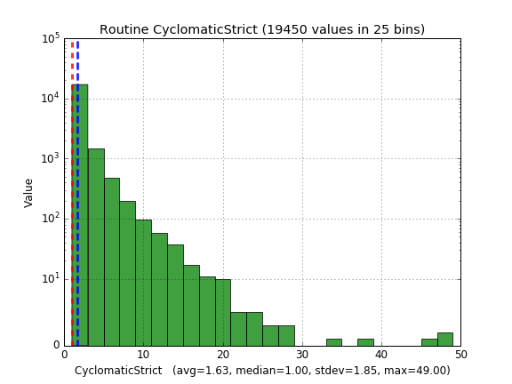
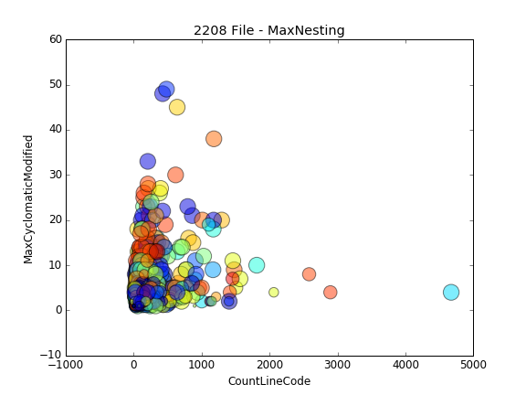
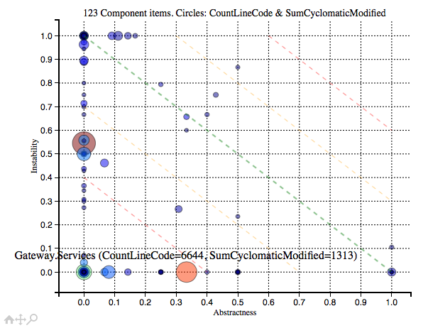

srccheck: a utility to [KALOI](http://structure101.com/2006/10/complexity-debt-dont-fix-it-keep-a-lid-on-it/) (Keep a Lid On It) source code on various metrics supported by [SciTools Understand](https://scitools.com).

Pre-requisites
===============
* This utility is written in Python 3. You will need a Python 3 interpreter installed or you will have to package
this into a self contained executable. 
* This utility uses [SciTools Understand](https://scitools.com). You will need a valid license of Understand
in your machine so you can use this script. This script uses a UDB file as input.
* (optional) [Jenkins](https://jenkins-ci.org)
* (optional) [SONAR](http://www.sonarsource.com)

What It Does
=============
You can use srccheck to fail your build (say in Jenkins) if a specific metric goes beyond a threshold you define.
It could be routine cyclomatic complexity, it could be max number of methods in a class, and so on. Basically any
[Understand Metric](https://scitools.com/support/metrics_list/) can be used. And it supports many programming
languages (Java, C++, Python, etc).

NOTE: There is one extra metric that Understand does not have natively but we do support: CountParams, for routines/functions/methods.
It represents the number of parameters a routine/function/method takes.

Beyond that, you can keep a trend dashboard of your metrics over time. For that, you need to have Jenkins installed
and its [Plot Plugin](https://wiki.jenkins-ci.org/display/JENKINS/Plot+Plugin) installed as well. srccheck can
generate the CSV file that this plugin requires (see our --outputCSV= command-line parameter).

If you want to publish some metrics as a dashboard in SONAR, you can also do it. For that, you must first
register Manual Measures in SONAR, and srccheck will use this [Manual Measures API](http://docs.codehaus.org/pages/viewpage.action?pageId=229743270).
The steps are:

 * Login into SONAR as Administrator
 * Configuration/Manual Measures
 * Add Measure

Note that the exit code of this script is the number of violations found. This allows you to incorporate srccheck
into your workflow regardless of the build tool used.

How to Install It
=================

Make sure your Python has paver installed (pip3 install paver) and then run:
```
pip3 install git+https://github.com/sglebs/srccheck
```

How to Upgrade It
=================

```
pip3 install --upgrade git+https://github.com/sglebs/srccheck
```

How to Install It Standalone On a Machine Without Python
========================================================

You can generate a self-contained executable that does not need a python interpreter on the target machine:

```
pip3 install pyinstaller
pyinstaller --exclude-module understand -F utilities/srccheck.py 
```

Now your *dist* directory should have a standalone native executable which you can copy to a different machine.


How to Run It
=============
Execute *srccheck --help* to see what the options are. Basically we take 4 different JSONs as input, which define:

 * --maxPrjMetrics , which defines the maximum allowed value for metrics that apply to the project as a whole.
 * --maxFileMetrics , which defines the maximum allowed value for metrics that apply to individual files.
 * --maxClassMetrics , which defines the maximum allowed value for metrics that apply to individual classes.
 * --maxRoutineMetrics , which defines the maximum allowed value for metrics that apply to individual routines (methods, functions, procedures, etc).
 
These JSONs are each a dictionary, where each key is the name of the metric and the value is the maximum value it can take.
Anything above is considered a violation. 

NOTE: instead passing literal json values you can also pass file paths to json files.

Examples
=========

Here is an example used to analyze Delphi code:

```
C:\>srccheck --in="C:\temp\PJ_DIARIO.udb" --maxFileMetrics={\"CountLineCode\":5000,\"CountDeclFunction\":40,\"CountDeclClass\":5} --maxClassMetrics={\"CountDeclMethod\":50,\"MaxInheritanceTree\":6}
--maxRoutineMetrics={\"CountLineCode\":1000,\"CountParams\":20,\"CyclomaticStrict\":24,\"CyclomaticModified\":12} --maxPrjMetrics={\"AvgCyclomatic\":2,\"MaxNesting\":5} --regexIgnoreFiles="tlb|[.]dfm" --regexIgnoreRoutines="ExecutaMetodoServidor|Invoke" --verbose
```

(Note that under the Windows shell you need to escape each " with a \ , as we show above).

If the command above fails, you may need to pass an appropriate --dllDir value. Or set PATH and PYTHONPATH:

```
C:\>set PYTHONPATH=C:\Program Files\SciTools-4.0.860-64b\bin\pc-win64\python

C:\>set PATH=%PATH%;C:\Program Files\SciTools-4.0.860-64b\bin\pc-win64

```


Here is an example that analyzes C++ code, using the defaults we provide:

```
srccheck --in=c:\temp\BlackJack.udb --sonarUser=admin --sonarPass=admin --sonarURL=http://localhost:9000/api/manual_measures --sonarPrj=BlackJack 
```

Here is a full example which installs srccheck in your global Python interpreter, gets SciTools Understand, gets the source code for junit,
invokes understand on its sources and then our tool:

```
sudo pip3 install --upgrade pip
sudo pip3 install paver
sudo pip3 install git+https://github.com/sglebs/srccheck
wget http://builds.scitools.com/all_builds/b864/Understand/Understand-4.0.864-Linux-64bit.tgz
tar xvf Understand-4.0.864-Linux-64bit.tgz
# make sure und is in the PATH
export PATH=$PATH:./scitools/bin/linux64/
git clone https://github.com/junit-team/junit.git
# run Understand from the GUI to activate the trial
understand
# now we can automate
und create -languages java junit.udb
und add ./junit/src/main/java/junit junit.udb
und analyze junit.udb
srccheck --dllDir=./scitools/bin/linux64/Python --in=junit.udb --maxFileMetrics='{"CountLineCode":500,"CountDeclFunction":30,"CountDeclClass":1}' --maxClassMetrics='{"CountDeclMethod":20,"MaxInheritanceTree":4}' --maxRoutineMetrics='{"CountLineCode":80,"CountParams":7,"CyclomaticModified":7}' --maxPrjMetrics='{"AvgCyclomaticModified":3,"MaxNesting":5}' --verbose
```

(Note that under the Linux shell you need to single-quote the json values and there is no need to escape each " with a \ like you do under Windows)

Averages and variances
======================
Understand does provide some metrics for averages. The problem is that these do not take into account our whitelist or 
blacklist of files. Also, not all metrics have Stdev, Avg etc equivalents. In order to fix this we added support to
compute a few derived stats metrics on any existing metric, using prefixes. They are:

   * AVG (uses statistics.mean)
   * MEDIAN (uses statistics.median)
   * MEDIANGROUPED (uses statistics.median_grouped)
   * MEDIANHIGH (uses statistics.median_high)
   * MEDIANLOW (uses statistics.median_low)
   * MODE (uses statistics.mode)
   * STDEV (uses statistics.pstdev)
   * VARIANCE (uses statistics.pvariance)
   
Example:  {CyclomaticModified":10, "STDEV:CyclomaticModified":1.8, "AVG:CyclomaticModified":2.2} 

The example above will raise an issue if the maximum CyclomaticModified goes above 10, but also if 
the average goes above 2.2 or the standard deviation goes above 1.8. This allows you to control not
only maximum values of your outliers, but also averages and the spread (how far off they spread).
We use the stats functions in https://docs.python.org/3/library/statistics.html .

Adaptive KALOI
==============
As you evolve your code and improve your metrics, the max values used in the command-line
to *srchcheck* will probably need to be revisited and adjusted, to keep your metric improvement
initiative steady. This process requires adjusting build scripts, and can be tedious. Because of
this, *srccheck* has adaptive support: it automatically lowers the maximum value accepted for 
the metric to the new, improved value, every time you manage to lower the current max value of that metric.

To make use of this feature, you will need two things:

   * use the -a flag (enables the adaptive behaviour)
   * pass file paths to json files instead of literal values to these parameters: --maxPrjMetrics , --maxFileMetrics, --maxClassMetrics, --maxRoutineMetrics

The json files will be modified in-place by *srccheck* with the new max limits, lowering the ones you managed to lower.
You are using *srccheck* to "lower the lid" of your KALOI initiative. Example:

```
srccheck --dllDir=/Applications/Understand.app/Contents/MacOS/Python --in=/Users/mqm/Downloads/messenger-server.udb --maxFileMetrics=./messenger-server/maxFileMetrics.json --maxClassMetrics=./messenger-server/maxClassMetrics.json --maxRoutineMetrics=./messenger-server/maxRoutineMetrics.json --maxPrjMetrics=./messenger-server/maxPrjMetrics.json -a
```

If you run the command above and maxFileMetrics.json has this in it: {"AVG:CountDeclClass": 999, "CountDeclClass": 999, "STDEV:CountDeclClass": 999}
then after the run it will look like this: {"AVG:CountDeclClass": 3.3, "CountDeclClass": 30, "STDEV:CountDeclClass": 5.78013840664737}

If we manage to lower the maximum number of classes a file can have (CountDeclClass) from 30 to 28, then 28 will
automatically become the new maximum acceptable value for this metric, thanks to the -a flag.


Histograms
==========
Sometimes metric values are very high and we want to visualize how the values are spread and their frequencies. 
With that in mind we added support to generate histograms from *srccheck*. The relevant flags are:

  * -H : enables histogram generation
  * -l : use the logarithmic scale (default is false - linear scale is the default)
  * -m : show the mean (avg) and median as two vertical lines in the graph
  
PNG files will be generated in the current dir, with the various histograms.  

If you just want to see the histograms without worrying about metric limits, the *srchistplot* tool
is bundled in and can be used - it plots histograms of the values found 
for the metric(s) you choose. It is similar to *srccheck* to run, with some minor differences. One of them is that 
you pass a comma-separated list of metric names for File, Class and Routine (and not max values as a json, as 
with *srccheck* itself). It also takes these same flags as above: -l , -m.

Here's how to just plot histograms for some metrics for the Django project:

```
srchistplot --dllDir=/Applications/Understand.app/Contents/MacOS/Python --in=/Users/mqm/Downloads/django.udb --fileMetrics=CountLineCode,CountDeclFunction,CountDeclClass --classMetrics=CountDeclMethod,MaxInheritanceTree --routineMetrics=CountLineCode,CountParams,CyclomaticStrict -l
```

One of the files that the line above will output will look like this:



Scatter Plots
=============
If you want to see how 2 metrics correlate, you can produce a scatter plot with the
*srcscatterplot* tool, also bundled in. It accepts a metric for the x axis, one for
the y axis and another one for the size of the balls (circles). Here's an
example for Django sources:

```
srcscatterplot --dllDir=/Applications/Understand.app/Contents/MacOS/Python --in=/Users/mqm/Downloads/django.udb --scope=Routine --xMetric=CountLineCode --yMetric=CyclomaticModified --ballMetric=MaxNesting
```



The plot will be an html file, interactive - you can roll your mouse on a circle
and it will show which element that is. (Not above - that's a screenshot).

Two items will have the same color if they belong to files in the same directory.
This means that colors represent clustering/packaging, usually.

Run *srcscatterplot -h* to see details for the parameters it can take.

OO Instability and Abstractness Plots
=====================================
 Bob Martin's whitepaper "OO Design Quality Metrics - An Analysis of Dependencies" describes
 two metrics - Instability and Abstractness - and how a good arquitecture should look
 like in such a graph. Some tools like PHP_Depend have support for it, as shown at
 https://pdepend.org/documentation/handbook/reports/abstraction-instability-chart.html
 
 We include a utility that can take a CSV as input, containing these values, and can
 plot such a graph: *srcinstplot*. Example:
 
```
srcinstplot --in=instability-myProject.csv 
```
 
 The CSV file should look like this:

```
Component,CountLineCode,SumCyclomaticModified,Efferent Coupling,Afferent Coupling,Instability,Classes,Abstract Classes,Abstractness,Distance,Normalized Distance
foo.bar,44,2,0,6,0.000000,2,0,0.000000,0.707107,1.000000
... 
...
```

The Component column will have the names of your components - package names (Java) or namespace names (C#) or Units (Pascal).
The second and third column can have any names - they should represent metrics for Size (circle sizes in the graph)
and Complexity (circle colors in the graph).

The result should look like the graph below.



If you roll the mouse on the circles, their names are shown, as well as the metrics that represent the circle size and
the circle color. Run the utility with -h for a detailed description of the parameters.
 
We also have a tool that generates such CSV files from an Understand UDB file, but it is not Open Source.
Feel free to contact us if you would like to use it.
 
 
 